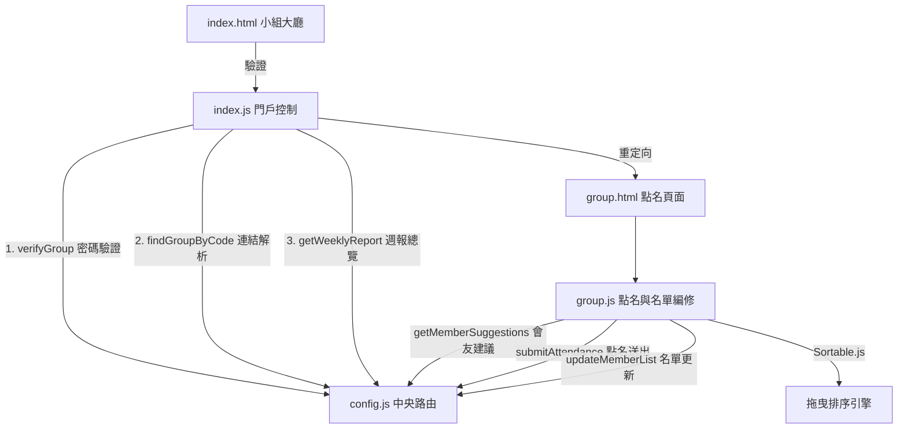
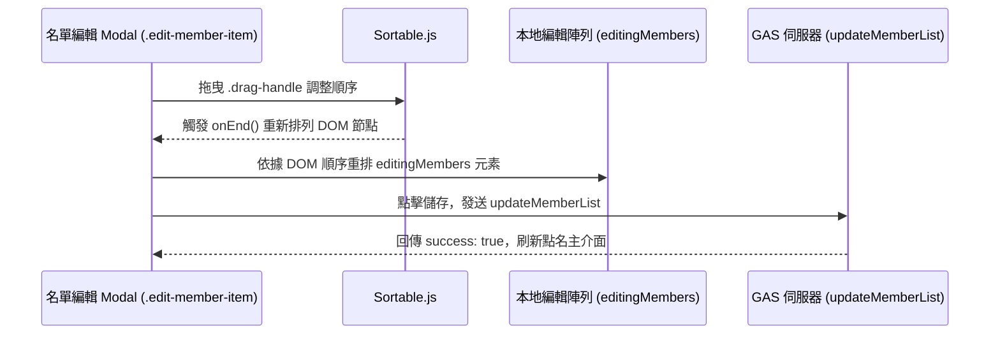

# 小組點名系統 — 前端 ARCHITECTURE.md

本專案為林口教會（LKC）各小組/團契專屬點名系統的前端 Web 應用程式，部署於 GitHub Pages。本系統提供小組長極簡的手機點名介面、小組歷史出席記錄追蹤，以及小組名單編修功能。

---

## 系統定位與依存關係

### 1. 系統定位
本系統（`LKC_Group`）專為教會小組長設計。為了簡化權限管理並保證隱私安全，系統具備**專屬驗證碼安全通道**。小組長無需註冊帳號，只需輸入各組的專屬四位代碼（如 `LK31`、`A002`），即可取得該小組的組員名單進行點名與歷史數據編輯，並支援快速跳轉至該組的事工排班表。

### 2. 依存金鑰與路由設定
* **_GAS_KEY**：宣告為 `LKC_Group_TEST`。
* **中央安全路由**：引用根目錄 `../../config.js`，自動將該 key 映射到 GAS 後端 URL（與主日出席共用同一組整合型 GAS 伺服器網址：`https://script.google.com/macros/s/AKfycbxBOFeLiXu23kBMGU8iSvRyJci6fruTfk7HdahhcQFY777sCPSgasuNM7Z1CeuzuS-r/exec`）。
* **Token 驗證**：請求標頭自動注入 `ChurchApp-2026` 作為授權憑證。

---

## 檔案結構與 UI 職責

專案中共有 11 個主要檔案，職責分配如下：

### 1. 小組入口與大廳
* `index.html`：小組系統大廳。顯示所有註冊的小組按鈕、建立新小組的 Modal、自訂身分驗證 Modal `#verifyModal`（用以代替傳統 `prompt()` 提升使用者體驗），以及「本週聚會人數」週報總覽彈窗。
* `index.js`：
  * 實作**專屬連結直接進入**邏輯：偵測網址參數 `?id=代碼`。若有代碼，則直接在背景呼叫 `findGroupByCode` 向後端查詢該代碼對應的小組名稱。若驗證通過，直接重定向進入 `group.html`。
  * 實作**自訂驗證彈窗與本地快取 (localStorage) 秒進機制**：小組長點擊小組按鈕後，會優先檢查 `localStorage` 是否已快取此小組的加密代碼（Key 格式：`group_code_小組名稱`）。若有快取，即實現 **0ms 驗證直接秒進小組點名頁**；若無快取，則呼叫自訂的 `#verifyModal` 驗證，輸入代碼並經 `verifyGroup` 驗證成功後，將加密金鑰存入 `localStorage` 快取並導頁。

### 2. 點名與名單編修 (Sortable.js 拖曳)
* `group.html`：點名主控台。分為「點名面板」與「初始化面板」。
* `group.js`：
  * **未初始化狀態**：若小組無成員，會呈現文本域（TextArea），小組長貼上換行分隔的名單後，調用 `initGroup` 進行初始化。
  * **已初始化狀態**：加載點名卡片清單。checkbox 的 value 使用會友 UUID。
  * **歷次紀錄編輯**：下載最近 3 次的聚會紀錄，並提供 Modal。小組長可在 Modal 中補點名、刪除紀錄（`deleteAttendanceRecord`）或修改新朋友資料（`updateAttendanceRecord`）。
  * **小組名單編修（拖曳排序）**：在編輯名單 Modal 中，系統透過 `getMemberSuggestions` 從主日會友大名單下載建議字元。當小組長新增會友時，若大名單有唯一同名會友，系統會自動帶入對應的 `uid`。此處整合了 `Sortable.js` 拖曳手勢，小組長可自由拖曳調整組員在點名表上的排列順序。點擊儲存後調用 `updateMemberList` 將排定後的 `editingMembers` 陣列（包含 name, uid, role, nickname）上傳覆蓋。

### 3. 後台管理與統計查詢
* `stats.html` / `stats.js`：歷史點名折線圖與完整出席率報表。
  * **網址列明文加密重寫防護**：網頁載入時若網址帶有明文 `?id=明文`，前端會即時以 `window.encryptGroupCode()` 進行 XOR 加密並重寫網址列為 `?id=enc_...`，隱藏真實 ID。
  * **查詢排隊佇列機制**：輸入框防抖時間從 `1000ms` 縮短至 `400ms`，狀態列加入 Spinner 特效。若使用者在代碼驗證（Debounce/API 請求）完成前立即點擊「查詢」，系統會清除防抖，並利用 `pendingVerificationPromise` 排隊等待驗證完成後直接自動跑完查詢，解決 UX 報錯痛點。
* `manage.html` / `manage.js`：小組大名單與管理員代碼重設後台。
  * **登入輔助優化**：在密碼輸入框 `#adminInput` 註冊了 `Enter` 鍵事件監聽，支援回車直接登入管理。
* `style.css`：定義了不同角色同工的身分標籤顏色（例如：核心同工 `role-core`、陪伴同工 `role-companion`、小羊 `role-sheep`），並包含載入遮罩的背景模糊與 Spinner 特效。

---

## 核心業務流程與 API 呼叫

### 1. 專屬連結進入流程
小組長將帶有 `?id=加密代碼` 的網址存於手機桌面或 LINE 記事本中，點擊後：
1. `index.js` 解析出 `id`。
2. 發送 POST `findGroupByCode` 給 GAS。
3. GAS 比對 `1yErbbQUXmnOGga-CyyEnC1E3sM6JrdNZYn7PkOe8jp0` (小組點名試算表) 上的資料。
4. 驗證成功後，GAS 回傳明文小組名稱 `groupName` 與加密代碼 `encryptedCode`。
5. 前端重定向至 `group.html?name=小組名&code=加密代碼`，之後的所有寫入或修改請求（例如 `submitAttendance`）皆會帶上 `groupCode: code`，交由後端驗證，無需重複輸入密碼。

### 2. 點名提交與快取失效
1. 小組長選取聚會日期，勾選出席人員，輸入新朋友（新朋友支援任意標點符號分隔，前端會以 `/[^\u4e00-\u9fa5a-zA-Z0-9\s]+/` 正則切割），點擊「送出點名」。
2. 前端收集已出席（`present`）與未出席（`absent`）的 UID 陣列，調用 `submitAttendance` 寫入 Sheets。
3. 寫入完成後，中央安全路由的快取失效機制（`_INVALIDATE_ON_WRITE`）會同時刪除 Firebase 快取主題 `getWeeklyReport`、`getStats`、`getAllGroupsStats` 與 `checkGroupStatus`，確保其他同工或主日點名系統查詢時能立即讀取最新數據。

---

## 前端元件與資料流向圖

### 元件結構與 API 依賴

### 小組成員名單拖曳更新資料流

