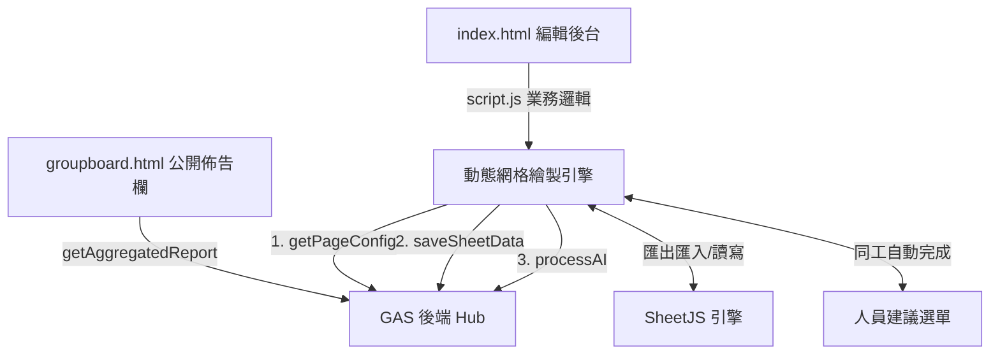
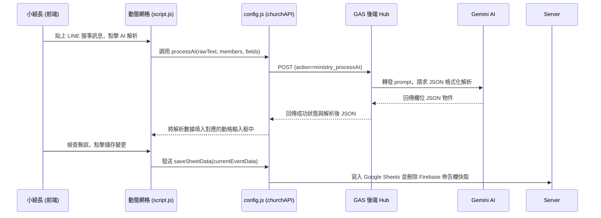

# 教會服事管理系統 — 前端 ARCHITECTURE.md

本專案為林口教會（LKC）各事工排班與小組服事管理系統的前端 Web 應用程式，部署於 GitHub Pages。本系統以動態二維網格表單為核心，支援自訂欄位排序、Excel 匯入匯出，以及整合 Gemini AI 自動排班與講道資訊連動。

---

## 系統定位與依存關係

### 1. 系統定位
本系統（`LKC_MinistrySchedule`）做為各小組、團契與事工團體（如敬拜團、音控組、招待組等）的排班工具。系統允許負責人動態新增/修改週六、主日服事班表，提供同工一鍵下載排班表，並將「今日起未來 7 天內」的聚會服事卡片彙整發佈至公開的「小組近期聚會佈告欄」，供全教會會友瀏覽。

### 2. 依存金鑰與路由設定
* **_GAS_KEY**：在 `index.html` 宣告為 `LKC_MinistrySchedule_TEST`。
* **中央安全路由**：引用根目錄 `../../config.js`，自動將該 key 映射到 GAS 後端 URL（與主日出席共用同一組整合型 GAS 伺服器網址）。
* **Token 驗證**：請求標頭自動注入 `ChurchApp-2026` 作為授權憑證。
* **分流字元**：由於與主日出席共用 GAS，中央安全路由會自動為本專案的所有 action 加上 `ministry_` 前綴（例如前端呼叫 `getPageConfig`，網路傳輸時自動重寫為 `ministry_getPageConfig`），防止與主日 action 衝突。

---

## 檔案結構與 UI 職責

專案中共有 5 個主要前端檔案，職責分配如下：

### 1. 核心頁面與動態網格
* `index.html`：系統管理主控台。
  * **#adminMain**：大廳畫面。列出所有已建立的排班分頁（如葡萄樹A組、音控組等），支援模糊搜尋過期/啟用的分頁，並設有「建立新分頁」按鈕。
  * **#createSection**：新增分頁表單。建立時要求選擇「聚會型模板」或「事工型模板」。
  * **#reportSection**：動態排班二維網格編輯區。包含日期區間快速篩選器、Excel 匯出匯入按鈕、AI 排班按鈕以及排班表設定。
  * **#unlockVerifyModal**：自訂 Bootstrap 5 權限驗證 Modal。代替瀏覽器原生 `prompt()`，供使用者輸入專屬 ID 解鎖編輯模式。
  * **#loading-overlay**：全螢幕模糊載入遮罩。在 AI 排班解析運算期間自動顯示，並鎖定 UI 防止重複操作。
* `script.js`：核心業務流程驅動程式。
  * **動態網格渲染**：解析從 `getPageConfig` 載入的欄位配置（`currentPageFieldConfig`），在 `#dynamicFormContainer` 中以 `<input>` 與 `<select>` 元素動態重繪整張二維排班表。
  * **欄位與人員維護**：支援在 Modal 中停用/啟用欄位，並支援批量新增/刪除此排班表的可排班人員大名單（`localCustomMembers`）。
  * **聖經/講道連動**：當啟用講道資訊連動時，若行事曆對應日期有講道資料，前端會自動載入該主日的講道主題與經文，自動填入對應欄位，減輕手動登錄負擔。
  * **本機驗證解鎖與 URL 混淆**：網頁載入時若網址帶有明文 `?id=明文`，前端會即時以 `window.encryptGroupCode()` 進行 XOR 加密並重寫網址列為 `?id=enc_...`，隱藏真實 ID。點擊編輯時，使用 `window.decryptGroupCode()` 對比輸入金鑰與解密後的 `currentId`，進行 0ms 延遲的前端本理解鎖。

### 2. 佈告欄與總表
* `groupboard.html`：公開的「小組近期聚會佈告欄」網頁。
  * 同時以 `getAggregatedReport` 抓取小組與團契的所有未來聚會資料。
  * 偵測當前日期，過濾出「今日起 7 天內」的所有聚會。
  * 針對每項聚會，自動排除元數據欄位，將其餘有填寫人名的欄位提取出來，渲染成服事職責卡片網格。
* `style.css`：為編輯網格、自訂 Modal 及全螢幕 `#loading-overlay` 模糊背景提供響應式 CSS 排版。

---

## 核心業務流程與 API 呼叫

### 1. 二維網格載入與欄位配置
當管理員點擊分頁進入編輯區時：
1. 呼叫 `getPageConfig` 獲取分頁名稱、表格模板、所有行資料（`currentEventData`）以及自訂欄位設定。
2. 呼叫 `buildPageFieldConfig()` 整理出啟用的欄位陣列 `currentTableHeaders`。
3. 根據 `currentTableHeaders` 動態在表格頂部繪製 `<th>` 標籤，並在下方逐行產生輸入框。
4. 前端提供「季度快速產生日期」功能（`generateQuarterRows`），小組長選取年度與季度後，前端自動計算出該季每個週六或主日的日期並插入表格中。

### 2. Gemini AI 排班解析
1. 管理員點擊「貼上排班內容」，彈出 AI 解析 Modal。
2. 在文字框內貼上來自 LINE 群組的服事名單（例如："6/10 敬拜：阿華，破冰：小明"）或排班規則（"小明不能連續兩週排破冰"）。
3. 點擊「AI 解析」後，前端將當前排班表的「欄位列表」、「同工名單」與「文字內容」包裝，發送 `processAI` 請求至後端。
4. 後端調用 Gemini 完成語意解析後，回傳標準的 JSON 資料列。前端接收後自動將數值填入對應日期與欄位的網格中，管理員確認無誤後點擊「儲存變更」即調用 `saveSheetData` 寫入 Sheets。

### 3. Excel 匯入與匯出 (SheetJS)
* **匯出**：調用 `XLSX.utils.json_to_sheet` 將當前篩選後的二維陣列直接在瀏覽器端轉換成 `.xlsx` 檔案下載，無需耗費伺服器資源。
* **匯入**：使用者上傳 `.xlsx` 檔，前端使用 `XLSX.read` 讀取並將其轉換成 JSON。系統會進行「日期格式標準化」，比對首行標題，將對應欄位的人員名單覆蓋寫入前端網格。

### 4. 編輯權限本理解鎖 (0ms 延遲)
為了消除網路延遲並提高解鎖效率，系統引入了**前端本地解密驗證**：
1. 點擊「進入編輯」按鈕時，不再發送 `verifyPageId` API 到 Google Apps Script，而是直接彈出自訂 Bootstrap 5 Modal。
2. 前端透過 XOR 解密演算法（密鑰為 `LKC-Secure-2026`）將當前加密的頁面 `currentId` 還原為原始明文代碼。
3. 比對使用者輸入的 ID 與還原後的原始代碼（或最高權限管理員代碼 `LK31`），若相符則當下在前端完成解鎖（0ms 延遲），極致流暢。

### 5. 網址列明文 ID 自動加密混淆保護
為了防止使用者直接從 URL 網址列獲取明文 ID 繞過解鎖保護：
1. 當網頁載入時，前端檢測網址的 `?id=...` 參數。若該參數為明文（非 `enc_` 開頭），會**在載入瞬間自動於前端進行 XOR 加密**。
2. 加密後，利用 HTML5 `history.replaceState` API **直接重寫網址列為加密後的 `?id=enc_...`**。此操作在頁面載入時無縫進行，既不影響後端數據撈取，也確保明文 ID 在瀏覽器地址列中隱形。
3. 系統生成的「複製分享網址」預先調用加密，確保使用者複製傳送的連結皆為安全的加密網址。

---

## 前端元件與資料流向圖

### 元件結構

### 貼上 LINE 文字 AI 自動排班資料流

