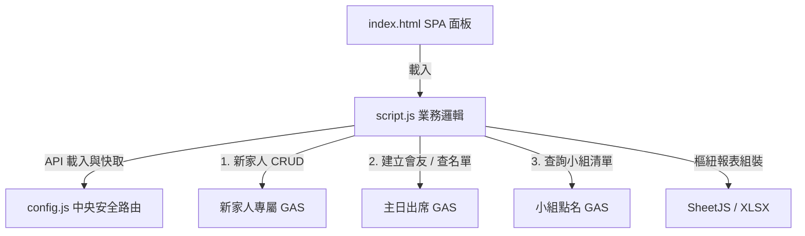
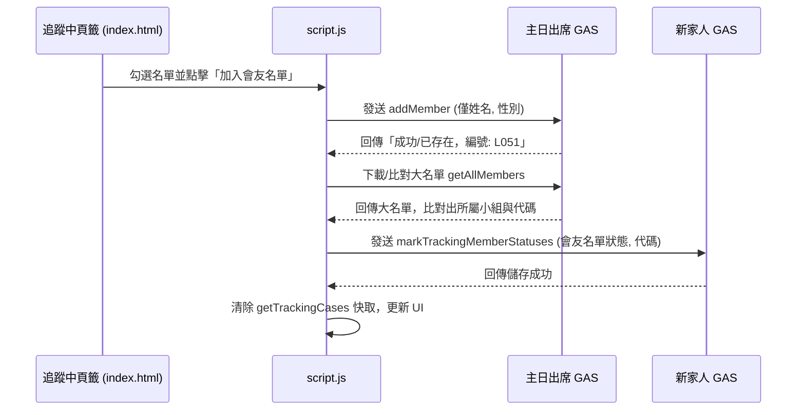

# 新家人留名與落戶追蹤系統 — 前端 ARCHITECTURE.md

本專案為林口教會（LKC）新家人/新朋友留名卡登錄、關懷跟進與落戶分析系統的前端 Web 應用程式，部署於 GitHub Pages。本系統整合了留名表單登錄、追蹤與結案個案管理、一鍵自動化轉入主日會友名單，以及交叉樞紐分析報表導出。

---

## 系統定位與依存關係

### 1. 系統定位
本系統（`LKC_NewFamily`）為教會關懷同工與新家人事工領袖的作業平台。
* **基本登錄**：新朋友來訪時，同工於手機或平板以 `index.html` 快速登錄新家人的聯絡資料與聚會背景。
* **追蹤與落戶跟進**：提供「追蹤中」與「已結案」個案列表。支持編輯 Modal、個案狀態變更，以及跨系統一鍵同步至主日出席大名單。
* **落戶成效分析**：根據結案資料，動態產生以季度/年份為維度、各養育小組為經緯的落戶率樞紐分析表，並直接在前端導出 Excel 報表。

### 2. 依存金鑰與路由設定
* **專屬配置檔**：專案透過 `api-config.js` 宣告多個後端 API GAS 網址：
  * `NEW_FAMILY_API_URL`：新家人追蹤專屬 GAS。(`AKfycbzU4f0XKtniINXQMbIK5QDPuT3ub2HeyiEYI60oUM3YHipdf-02uvuP3lp963dogxml/exec`)
  * `SUNDAY_ATTENDANCE_API_URL`：主日出席管理 GAS（用於轉入會友與查詢聚會設定）。(`AKfycbxBOFeLiXu23kBMGU8iSvRyJci6fruTfk7HdahhcQFY777sCPSgasuNM7Z1CeuzuS-r/exec`)
  * `GROUP_ATTENDANCE_API_URL`：小組出席管理 GAS（用於獲取現行小組清單作為落戶選項）。(`AKfycbxBOFeLiXu23kBMGU8iSvRyJci6fruTfk7HdahhcQFY777sCPSgasuNM7Z1CeuzuS-r/exec`)
* **Token 驗證**：統一配置 `ChurchApp-2026`。
* **中央路由 config.js**：系統引入根目錄 `../../config.js` 提供底層 API 通訊與快取。

---

## 檔案結構與 UI 職責

專案中共有 5 個主要檔案，職責分配如下：

### 1. 核心網頁與設定
* `api-config.js`：定義後端三個 GAS 服務的對接終端網址與授權 Token。
* `index.html`：整合式單頁應用程式（SPA）。包含以下四大頁籤：
  * **新家人留名表單**：提供乾淨的留名卡輸入項（含姓名、性別、手機、聚會場次、年齡層、來訪原因等）。
  * **追蹤中個案**：列表展示未結案個案。支援多人選取「一鍵轉正式會友」、「一鍵結案」，點選單列開啟「詳細資料編輯 Modal」。
  * **已結案個案**：列表展示已落戶小組或停止聚會的個案，並自動比對並標示主日點名系統中的最新狀態。
  * **落戶分析預覽**：提供樞紐透視分析、按年分區間過濾，提供一鍵導出 Excel。
* `style.css`：定義了 SPA 頁籤卡片切換、響應式表單網格，以及狀態配色（如已落戶小組以綠色標籤表示、請安拜訪以藍色表示、停止聚會以紅色表示）。

### 2. 業務控制邏輯
* `script.js`：
  * **頁籤與表單控制**：實作 `switchTab(tabName)` 與表單提交事件監聽器。
    * 新家人表單只有在姓名比對到既有主日會友時，才送出 `會友狀態=已加入`；未比對到會友時不送出會友狀態，欄位維持空白，不使用「未加入」標記。
  * **API 請求與快取**：實作 `callApi(action, data)`。針對 `getTrackingCases` 與 `getClosedCases` 兩項載入動作，實作 `callCachedListApi()` 快取包裝，設定 TTL 19800 秒（5.5 小時）。
  * **跨系統資料流同步（一鍵轉會友）**：當同工點擊「加入會友名單」：
    1. 呼叫主日出席 API 的 `addMember` 新增會友；基於個資最小化，跨系統欄位契約僅允許新家人追蹤資料的 `姓名` → `name`、`性別` → `gender`，不得傳送備註或其他欄位。
    2. 從主日出席 API 的 `getAllMembers` 下載最新大名單（並以 `memberDirectoryPromise` 加以快取），以正則解析出新會友的「點名代碼」（如 `L012` 等）與所屬小組。
    3. 呼叫新家人 API 的 `markTrackingMemberStatuses` 將新家人追蹤表上的狀態回寫為「已加入」或「已存在」，並填入「點名系統代碼」。
  * **落戶統計分析統計**：實作 `buildSettlementPivot` 將結案數據依年份、季度、小組統計人數。
  * **Excel 樞紐活頁簿導出**：實作 `exportCombinedWorkbook()` 結合 SheetJS（XLSX），在前端動態組裝多頁工作表：第一頁為依據小組與季度的交叉樞紐統計表（包含合計與百分比），第二頁為明細清單，並套用適當字體與顏色樣式導出。

---

## 核心業務流程與 API 呼叫

### 1. 新家人轉正式會友業務流程
```text
同工於「追蹤中」頁籤勾選新朋友 (可多選)
  ↓
點擊「一鍵加入會友名單」
  ↓
對 [SUNDAY_ATTENDANCE_API_URL] 發送 'addMember' 請求
  ↓
主日系統新增會友，並回傳格式化訊息 (含指派之代碼)
  ↓
前端載入主日大名單 'getAllMembers' (大名單在本地 promise 快取)
  ↓
比對同名會友之 `memberCode` (代碼) 與 `sundayGroup` (主日小組)
  ↓
對 [NEW_FAMILY_API_URL] 發送 'markTrackingMemberStatuses'
  ↓
更新追蹤表之「會友名單狀態: 已加入/已存在」與「點名系統代碼」
  ↓
重新載入追蹤列表 (清除快取)
```

### 2. 快取失效機制 (Invalidation Map)
新家人追蹤列表使用 Firebase 快取。當執行以下寫入/變更 action 時，中央路由 `config.js` 會自動呼叫 `cacheDeleteAll` 清除相關快取主題：
* 寫入 `submitNewFamily`（新增留名）：清除 `getTrackingCases`、`getClosedCases` 快取。
* 寫入 `updateTrackingCase`（編輯個案）：清除 `getTrackingCases`、`getClosedCases` 快取。
* 寫入 `markTrackingMemberStatuses`（標記會友狀態）：清除 `getTrackingCases` 快取。
* 寫入 `closeCases`（結案）：清除 `getTrackingCases`、`getClosedCases` 快取。
* 寫入 `deleteTrackingCase`（刪除個案）：清除 `getTrackingCases`、`getClosedCases` 快取。

---

## 前端元件與資料流向圖

### 元件結構與 API 依賴


### 一鍵轉會友與資料同步流

