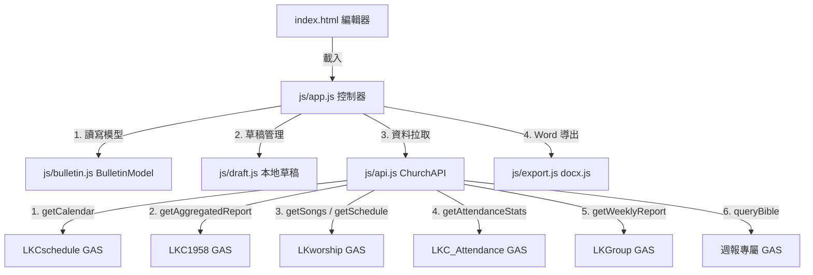
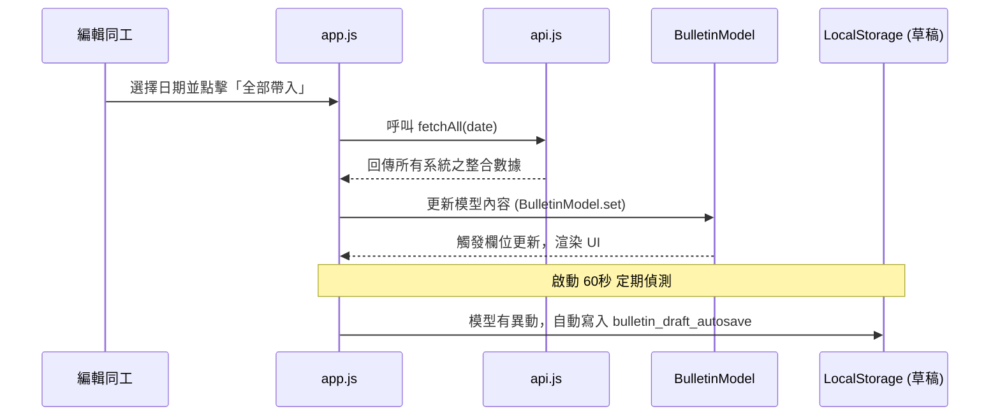

# 週報生成與管理系統 — 前端 ARCHITECTURE.md

本專案為林口教會（LKC）每週主日週報編輯與 Word 導出系統的前端 Web 應用程式，部署於 GitHub Pages。本系統提供一鍵並行拉取跨子系統數據、本地編輯與校對、草稿自動儲存，以及利用 `docx.js` 動態渲染導出排版精美之 Microsoft Word（.docx）週報檔案之功能。

---

## 系統定位與依存關係

### 1. 系統定位
本系統（`LKC_SundayBulletin`）供教會行政同工與週報編輯者使用。週報編輯講求高效率與準確性，本系統旨在取代傳統的手動複製貼上。同工只需選取本週主日日期，系統即自動調用多個子系統 API，將當週的講道經文、服事人員、上週出席人數、小組聚會統計與活動預告自動代入。同工在前端進行校對、手動補充本會消息與代禱事項後，即可一鍵導出週報 Word 檔以進行後續排版印刷。

### 2. 依存金鑰與路由設定
本系統不加載全域的根目錄 `config.js`，而是使用專屬的 `js/config.js` 設定檔以對接多個獨立的 GAS 後端：
* **SHARED_TOKEN**：統一使用 `ChurchApp-2026` 進行 GAS 安全驗證。
* **依存 GAS 網址一覽**：
  * `LKCSCHEDULE_GAS_URL`：對接行事曆系統，讀取講題、講員、經文與活動。(`AKfycbwiYYWgKxmLRAEaE_pbp_kWyAzlRPcwYVQfvmJVamRJvosvt5wTTkvwebbFBkP8rMqX/exec`)
  * `LKC1958_GAS_URL`：對接事工管理系統，讀取台語/華語主日服事同工排班。(`AKfycbx4268IkgwQm2Es0gjDHLU_U9nKJrRMR1-xzbbtuaq08lePLgAQ2wnDRrCeHdy9jNhh/exec`)
  * `LKWORSHIP_GAS_URL`：對接敬拜團系統，讀取敬拜主領與當週曲目。(`AKfycbyk_6tUucVg-U4rRQjYHvk632teZyxufDkNX_X1WRUXPMGgsTaemVXD_mv9kBDjuSwOnA/exec`)
  * `LKC_ATTENDANCE_GAS_URL`：對接主日點名系統，讀取上週日禮拜人數統計。(`AKfycbxBOFeLiXu23kBMGU8iSvRyJci6fruTfk7HdahhcQFY777sCPSgasuNM7Z1CeuzuS-r/exec`)
  * `LKGROUP_GAS_URL`：對接小組點名系統，讀取小組聚會出席人數。(`AKfycbxBOFeLiXu23kBMGU8iSvRyJci6fruTfk7HdahhcQFY777sCPSgasuNM7Z1CeuzuS-r/exec`)
  * `GAS_SYNC_URL`：週報系統專屬 GAS，用於信望愛聖經經文查詢。(`AKfycbyLLQZsz_XZqhWVwaT_8hcvfQc8fSWztAncEmBUk7lnzGr-TcP33uzS-weUG_cavgEn/exec`)

---

## 檔案結構與 UI 職責

專案中共有 8 個主要檔案，職責分配如下：

### 1. 編輯主畫面與樣式
* `index.html`：編輯與控制主畫面。提供分頁頁籤、日期選擇、自動帶入按鈕，以及對應週報版面的各編輯區塊（主日程序、同工、聚會人數、消息、代禱、奉獻）。
* `css/style.css`：週報專屬排版 CSS。定義了雙欄主日程序配置、統計表格捲軸容器，以及浮動通知（Toast）與進度遮罩樣式。

### 2. 業務控制邏輯與 API 封裝
* `js/config.js`：配置所有 GAS 服務網址、安全 Token、預設小組名單與主日學班別。
* `js/api.js`：封裝所有 API 請求邏輯（`callGAS`, `callLKC1958`, `callAttendance`）：
  * `fetchCalendarForDate`：拉取行事曆中該主日的講題、講員、經文與未來三個月活動預告。
  * `fetchServiceSchedule`：拉取 LKC1958 中的司會、司琴、音控等同工名單。
  * `fetchWorshipSchedule` / `fetchWorshipSongs`：拉取華語禮拜敬拜主領與曲目明細。
  * `fetchAttendance`：查詢**上一個週日**的主日出席人數（參照日期往前推 7 天）。
  * `fetchSmallGroups`：查詢**主日前一週（週日到週六）**之小組聚會統計人數。
  * `queryBible`：透過 API 查詢信望愛聖經經文，供編輯校對參考。
  * `fetchAll`：利用 `Promise.allSettled` 並行執行上述 6 項拉取作業。
* `js/bulletin.js`：實作前端週報資料模型 `BulletinModel`。維護一個全域的週報 JSON 結構（含程序、同工、人數、消息等欄位），提供屬性 get/set 方法。
* `js/draft.js`：實作本地草稿管理。透過 `localStorage` 儲存草稿，支援定時自動儲存（預設 60 秒）與手動儲存/讀取歷史草稿（上限 10 筆）。
* `js/app.js`：控制器核心。負責處理頁面加載初始化、頁籤切換、UI 元素與 `BulletinModel` 之間的雙向同步、點擊全部帶入時的異步流程協調。
* `js/export.js`：Word 導出引擎。整合外部 `docx.js` 與 `FileSaver.js` 庫，讀取 `BulletinModel` 資料，動態構建包含表格、單元格邊框、粗體文字與間距設定的 `docx.Document` XML 架構，並導出下載為 Word 檔案。

---

## 核心業務流程與 API 呼叫

### 1. 資料全部帶入流程
```text
同工於 index.html 選擇「主日日期」
  ↓
點擊「全部帶入」按鈕
  ↓
JS 調用 ChurchAPI.fetchAll(date)
  ↓
並行發送 6 個非同步 API 請求 (對接 5 個 GAS 與 1 個 Bible 服務)
  ↓
1. 行事曆 (講題/講員/經文)    2. 事工排班 (司會/音控等同工)
3. 敬拜團 (主領與曲目)        4. 主日點名 (上週主日出席數)
5. 小組點名 (上週小組統計數)   6. 活動預告 (未來 3 個月行事曆)
  ↓
資料返回後，前端執行資料比對與清洗，寫入 BulletinModel
  ↓
更新 UI 上所有的 Input/TextArea 輸入框，並顯示成功 Toast
```

### 2. 聚會出席人數統計日期定義
* **主日禮拜人數**：週報記載的是「上週日」的人數。因此當週報日期為 `date` 時，系統會自動將日期減去 7 天，去主日點名系統查詢該天的出席人數（實到會友數 + 男新朋友 + 女新朋友）。
* **小組聚會人數**：小組聚會發生在週間。因此系統會計算小組統計區間為：`主日日期 - 7天 (上週日)` 至 `主日日期 - 1天 (上週六)`，並查詢此區間內的小組出席統計。

### 3. 本地草稿自動儲存機制
週報編輯為中大型表單登錄。系統在初始化時會啟動 `js/draft.js` 的 `autoSave` 機制：
1. 每隔 60 秒，系統偵測 `BulletinModel` 是否已被修改（標記為 Dirty）。
2. 若有修改，自動將當前 JSON 結構序列化存入 `localStorage` 中（Key 前綴為 `bulletin_draft_`）。
3. 使用者可隨時點擊「載入草稿」，系統會讀取本地所有草稿並列出時間戳記供使用者復原。

---

## 前端元件與資料流向圖

### 元件結構與 API 依賴


### 一鍵全部帶入與自動儲存資料流

