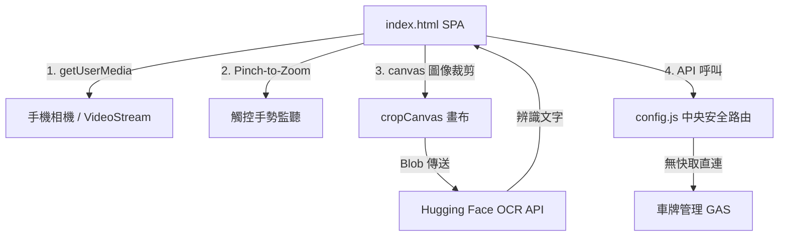
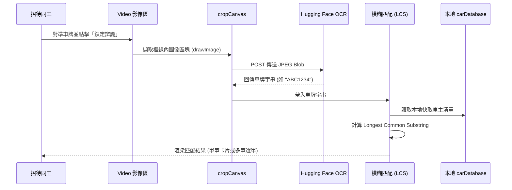

# 車牌管理與車主辨識系統 — 前端 ARCHITECTURE.md

本專案為林口教會（LKC）車主資料庫與車牌即時辨識系統的前端 Web 應用程式，部署於 GitHub Pages。本系統整合了手機鏡頭即時影像擷取、兩指觸控縮放、Hugging Face OCR 線上車牌辨識，以及最長公共子字串（LCS）模糊搜尋演算法。

---

## 系統定位與依存關係

### 1. 系統定位
本系統（`LKC_WhosCar`）專為教會主日招待、交通指揮同工設計。當有車輛阻擋通道、需要緊急移車時，同工可直接用手機鏡頭對準車牌進行辨識，或以手動輸入關鍵字，系統會立即模糊搜尋出車主姓名與聯絡電話，並提供一鍵撥號功能。

### 2. 依存金鑰與路由設定
* **_GAS_KEY**：宣告為 `LKC_WhosCar`。
* **中央安全路由**：引用根目錄 `../../config.js`，對應專屬 GAS 後端網址：
  `https://script.google.com/macros/s/AKfycbxOkoaNquIx_V8n_7eS_5ULmoqxPVly_Bezx9_QsmWSzNOcojrCI9Oa6UNd5hOD2euS/exec`。
* **外部 OCR 服務**：
  * 推理空間：Hugging Face 專屬 OCR API：`https://jirehwang-ocr.hf.space/ocr`。
  * 防休眠機制：在載入時啟動定時器，每 4 分鐘 ping 一次 `https://jirehwang-ocr.hf.space/health`。
* **快取說明**：為了保證移車資訊的即時性，本系統之 API 動作（`getAllCarData` 與 `savePlate`）**不使用** Firebase RTDB 快取，每次開啟與存檔皆與 GAS 進行直連通訊。

---

## 檔案結構與 UI 職責

本專案採極簡設計，包含 3 個檔案：

### 1. 單一網頁應用程式
* `index.html`：包含完整的 HTML、CSS 與 JavaScript 業務邏輯。
  * **主頁面 UI**：包含頂部標題、鏡頭辨識按鈕、手動輸入框、模糊匹配候選清單（Candidate List）、以及唯一匹配卡片（車主、車號、聯絡電話與一鍵撥號連結）。
  * **相機 Modal**：全螢幕黑色遮罩，居中渲染 `<video>`。提供綠色半透明車牌對準框（Overlay）、兩指縮放（Pinch-to-Zoom）手勢控制、拉桿滑動變焦，以及鏡頭切換按鈕。
  * **資料庫管理 Modal**：提供車牌號碼、車主姓名、電話的建立與編輯欄位，支援在此直接調用相機掃描並自動帶入車號。
  * **隱藏元件**：`<canvas id="cropCanvas">` 用於擷取並裁剪對準框內的影像。
* `README.md`：簡短的專案描述。
* `robots.txt`：禁止搜尋引擎編入索引。

---

## 核心業務流程與 API 呼叫

### 1. 手動模糊搜尋與 LCS 演算法
1. 使用者在輸入框輸入車牌號碼。
2. 系統啟動 100ms 防抖（Debounce）定時器。若輸入長度小於 2 個字元則隱藏結果。
3. 超過 100ms 後，執行 `executeSearch(q)`。
4. 系統走訪手機記憶體內的 `carDatabase` 陣列：
   * 若車牌與輸入完全一致，匹配度設為最高。
   * 若不一致，則執行 `getLongestCommonSubstring(dbPlate, cleanInput)` 計算最長公共子字串長度。
   * 若 LCS 長度達到臨界值（輸入字元長度少於 4 碼時以長度為準，大於等於 4 碼時以 4 碼為準），則視為候選對象。
5. 排序演算法：先依匹配長度（LCS）降冪排序；LCS 相同時，依車牌長度與輸入長度的絕對值差升冪排序（越接近者排越前面）。
6. 前端渲染結果：若只有 1 筆結果，直接呈現詳細車主卡片；若有多筆結果，則列出候選按鈕清單供同工點選。

### 2. 車牌掃描與 OCR 辨識流程
```text
同工點擊「開啟鏡頭掃描車牌」
  ↓
呼叫 navigator.mediaDevices.getUserMedia() 取得相機影音串流
  ↓
將串流寫入 <video> 播放，並初始化 Zoom 控制 (偵測硬體變焦能力)
  ↓
支援 Pinch-to-Zoom 兩指手勢與 slider 拉桿進行即時相機對焦變焦
  ↓
同工將車牌對準綠色框線，點擊「鎖定並辨識」
  ↓
前端擷取 <video> 畫面，依據框線比例裁剪並畫入 <canvas id="cropCanvas">
  ↓
將 canvas 輸出成 Blob (image/jpeg, 品質 0.95)
  ↓
以 FormData POST 傳給 Hugging Face OCR API [https://jirehwang-ocr.hf.space/ocr]
  ↓
回傳辨識文字，前端正則清洗非英數符號，自動帶入輸入框
  ↓
自動觸發 executeSearch() 顯示搜尋結果，關閉相機 Modal
```

### 3. 車主資料儲存流程
1. 同工於資料庫 Modal 輸入或編輯完車主資料後，點擊「儲存至資料庫」。
2. 前端呼叫 `saveData()`。
3. 發送 fetch GET 請求：`${GAS_API_URL}?action=savePlate&plate=車牌&name=姓名&tel=電話`。
4. GAS 寫入 Google Sheets 資料表。
5. 寫入成功後，前端呼叫 `fetchAllData()` 下載最新名單以更新本地 `carDatabase` 記憶體緩存，並動態更新 `<datalist>` 的手動輸入自動完成選項。

---

## 前端元件與資料流向圖

### 元件結構與 API 依賴


### 車牌辨識與匹配資料流

