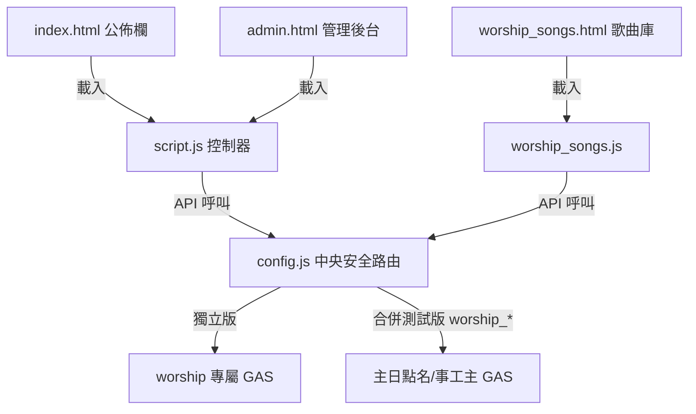
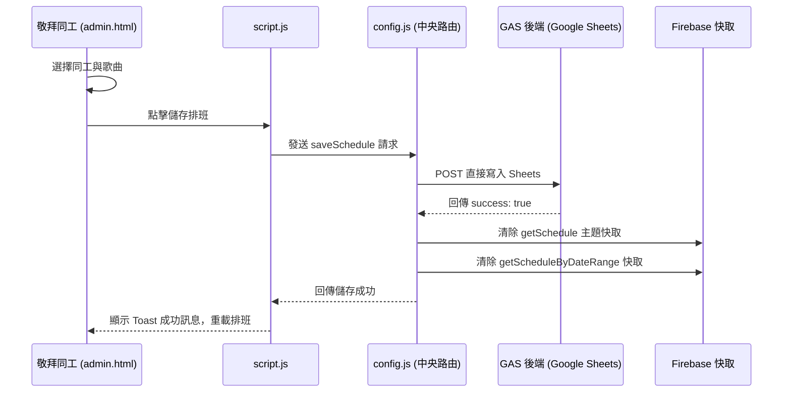

# 敬拜團服事與曲目管理系統 — 前端 ARCHITECTURE.md

本專案為林口教會（LKC）敬拜團專屬服事排班與曲目管理系統的前端 Web 應用程式，部署於 GitHub Pages。本系統提供團員及會友查閱季度服事表、敬拜歌曲庫管理，以及管理同工進行排班、服事崗位與團員名單編修的後台。

---

## 系統定位與依存關係

### 1. 系統定位
本系統（`LKC_worship`）服務於林口教會敬拜團團員與同工。
* **一般團員/會友**：透過 `index.html` 快速查閱當季每週主日的服事同工（主領、配唱、樂手、音控等）、當週敬拜歌曲（歌名、調性、拍子與歌譜/影音連結）。
* **敬拜團負責人/管理同工**：透過 `admin.html` 與 `worship_songs.html` 進行季度空白表單產生、排班編輯、歌曲庫 CRUD、服事崗位設定與團員大名單管理。

### 2. 依存金鑰與路由設定
* **_GAS_KEY**：宣告為 `LKC_worship`（測試環境自動切換為 `LKC_worship_TEST`）。
* **中央安全路由**：引用根目錄 `../../config.js`，依據 KEY 對應不同的 GAS 部署網址：
  * **獨立/舊版 (LKC_worship)**：指向專屬 GAS `https://script.google.com/macros/s/AKfycbyk_6tUucVg-U4rRQjYHvk632teZyxufDkNX_X1WRUXPMGgsTaemVXD_mv9kBDjuSwOnA/exec`
  * **合併/測試 (LKC_worship_TEST)**：指向主 GAS `https://script.google.com/macros/s/AKfycbxBOFeLiXu23kBMGU8iSvRyJci6fruTfk7HdahhcQFY777sCPSgasuNM7Z1CeuzuS-r/exec`。此模式下，所有呼叫的 action 都會自動加上前綴 `worship_`。
* **Token 驗證**：請求標頭自動注入 `ChurchApp-2026`。

---

## 檔案結構與 UI 職責

專案中共有 6 個主要檔案，職責分配如下：

### 1. 敬拜團公佈欄 (一般使用者介面)
* `index.html`：服事表公開看板。使用者可透過下拉選單切換季度（如 `2026-Q1`, `2026-Q2`），即時渲染出對應季度的每週主日服事名單、當週講題/講員，以及點擊可看詳情的敬拜曲目列表。
* `style.css`：定義了公佈欄與後台的排版樣式，包含響應式卡片格線、表格捲軸容器，以及狀態標籤。

### 2. 敬拜團管理後台 (同工操作介面)
* `admin.html`：管理員主控台。分為四大頁籤功能：
  1. **季度服事表**：提供特定季度排班編輯。支援一鍵匯出 Excel。
  2. **崗位設定**：定義崗位（如：主領、配唱、鋼琴、爵士鼓、木吉他、貝斯、PPT、音控等）與顯示順序。
  3. **同工名單**：敬拜團員管理。可在此設定團員姓名、簡稱，並以核取方塊勾選該團員可服事的崗位，以利排班時進行防錯過濾。
  4. **行事曆連結**：可在此設定當排班表串接「教會行事曆」時，預設讀取的講道事項子類型（如：華語禮拜），並可手動清除快取或設定特定日期的覆寫。
* `script.js`：
  * **API 封裝**：實作 `callAPI(action, payload)` 連接 `window.churchAPI`。
  * **服事表加載**：呼叫 `getSchedule`（依據 `{ year, quarter }`）或 `getScheduleByDateRange`（依據自訂日期區間）。
  * **排班表編輯與儲存**：提供視覺化下拉選單（自動過濾該崗位對應的同工），編輯完後以 `saveSchedule` 寫入。
  * **排班產生器**：實作 `generateQuarterlyDates()`，輸入年分與季度，自動計算出該季內所有星期日的日期，並初始化空白排班資料。
  * **崗位與名單編輯**：讀取與儲存崗位定義（`getPositions`, `savePositions`）及團員資料（`getTeamMembers`, `saveTeamMembers`），大名單新增會友時支援 `getMemberSuggestions` 自動推薦。
  * **手動清除快取**：調用 `window.churchAPIInvalidate('getSchedule')` 等強制刷新前端快取。

### 3. 歌曲庫管理
* `worship_songs.html`：敬拜曲目管理介面。提供歌曲大清單、關鍵字搜尋，以及歌曲的 CRUD Modal。
* `worship_songs.js`：
  * 呼叫 `getSongs` 載入完整歌曲庫（含歌名、調性 Key、速度 BPM、歌詞/譜連結、Youtube/影音連結）。
  * 新增或編輯歌曲後，整合 `saveSongs` 將全部歌曲清單打包寫回 Google Sheets 資料庫。

---

## 核心業務流程與 API 呼叫

### 1. 季度排班產生與存檔流程
1. 同工於 `admin.html` 選擇年份 (如 `2026`) 與季度 (如 `Q1`)。
2. 點擊「產生該季空白列」，前端計算出所有星期日的 YYYY-MM-DD。
3. 同工在表格的每一格為各崗位選擇同工，亦可點選「帶入行事曆講題與講員」。
4. 編輯完成後，點擊「儲存服事表」，呼叫 `saveSchedule` 傳送 `{ scheduleData }` 寫入 Sheets。
5. 中央安全路由觸發快取 invalidation，刪除快取 `getSchedule` 與 `getScheduleByDateRange`。

### 2. 敬拜曲目查詢與關聯
1. 當使用者在 `index.html` 點擊某週的歌曲名稱時，前端會從 `getSongs` 快取中尋找該歌曲的詳細資訊（如調性、Youtube 連結）。
2. 在 `admin.html` 編輯每週服事表時，可以直接從歌曲庫的 `getSongs` 名單中，以 autocomplete 方式選擇本週要唱的 3~4 首歌曲。

### 3. 快取失效機制 (Invalidation Map)
為保障前端載入效能，讀取 action 均配置了 Firebase 6 小時快取。當執行以下寫入 action 時，會同步清除對應的快取主題：
* 寫入 `saveSchedule` / `worship_saveSchedule`：清除 `getSchedule` / `worship_getSchedule`、`getScheduleByDateRange` / `worship_getScheduleByDateRange` 快取。
* 寫入 `saveSongs` / `worship_saveSongs`：清除 `getSongs` / `worship_getSongs`、`getSchedule` / `worship_getSchedule` 快取。
* 寫入 `savePositions` / `worship_savePositions`：清除 `getPositions` / `worship_getPositions`。
* 寫入 `saveTeamMembers` / `worship_saveTeamMembers`：清除 `getTeamMembers` / `worship_getTeamMembers`。
* 教會行事曆的成功寫入會由主 GAS 主動清除敬拜團的 Firebase topic 與跨表 `CacheService`（包含正式獨立版），不依賴使用者瀏覽器或管理入口 Router 的人工刷新。

---

## 前端元件與資料流向圖

### 元件結構與 API 依賴

### 季度排班與快取失效資料流

