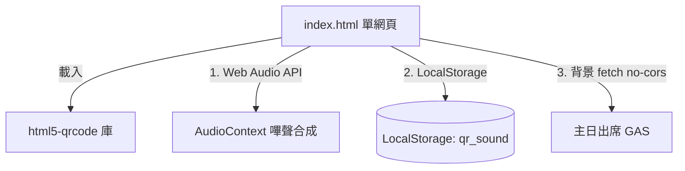
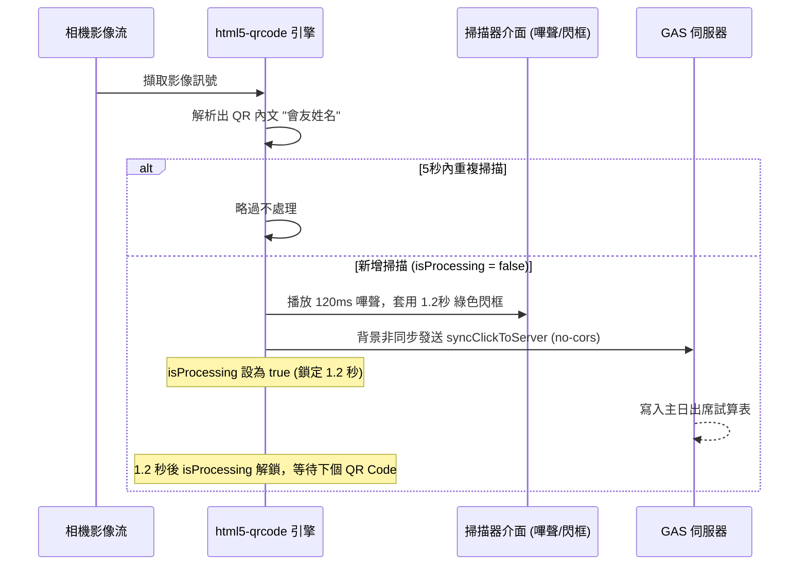

# QR Code 點名登記掃描器 — 前端 ARCHITECTURE.md

本專案為林口教會（LKC）聚會點名與出席登記專用之 QR Code 掃描器的前端 Web 應用程式，部署於 GitHub Pages。本系統整合了 HTML5 設備相機影音控制（防相機衝突機制）、Web Audio API 即時音效合成、非同步背景數據同步，以及防重複掃描防抖限制。

---

## 系統定位與依存關係

### 1. 系統定位
本系統（`qrcodescanner.github.io`）專為教會主日學同工、招待或活動窗口設計。會友持手機顯示其專屬個人 QR Code（內含姓名或識別代碼），同工只需使用本網頁掃描，即可即時完成點名。為應對現場快速進場的龐大人流，本系統在掃描成功後，會以**非同步背景通訊**直接向伺服器寫入，不因網路延遲而中斷同工的連續掃描動作。

### 2. 依存金鑰與路由設定
* **直連主 GAS 服務**：本專案為輕量化獨立工具，不引入全域的 `config.js`，而是直接宣告主日點名系統的 GAS URL：
  `https://script.google.com/macros/s/AKfycbxBOFeLiXu23kBMGU8iSvRyJci6fruTfk7HdahhcQFY777sCPSgasuNM7Z1CeuzuS-r/exec`
* **認證與參數**：
  * 操作同工可透過 URL 查詢參數（如 `?userId=同工姓名` 或 `?uid=同工代碼`）標記此點名紀錄的登錄者。
  * 掃描後的傳送動作為 `syncClickToServer`。

---

## 檔案結構與 UI 職責

本專案結構極簡，由 2 個主要檔案組成：

### 1. 掃描器主網頁
* `index.html`：包含 HTML 佈局、CSS 動畫與 JavaScript 業務控制。
  * **影像預覽區**：`<div id="reader">`，全螢幕展示，整合 `html5-qrcode` 庫繪製綠色對角線對準框。
  * **音效解鎖提示**：由於現代瀏覽器（特別是 iOS Safari 與 Android Chrome）限制未與使用者互動前播放音訊，頂部狀態提示列會先顯示「觸碰螢幕以啟用響鈴」，同工點選任何地方即可啟用音效並切換狀態。
  * **響鈴控制開關**：左下角 `sound-btn` 可切換響鈴開關（Sound On/Off），並將狀態儲存於 `localStorage.qr_sound` 中。
  * **鏡頭切換按鈕**：右下角 `switch-btn` 允許在多個相機裝置（前鏡頭、後置主鏡頭、超廣角鏡頭）之間循環切換。
  * **成功視覺效果**：掃描成功時，`#flash` 容器會顯示並閃爍綠色邊框，同時影像區域會套用縮放跳動動畫（`pulse-visual`）提供同工強烈的手勢操作確認。
* `README.md`：簡短的專案說明。

---

## 核心業務流程與 API 呼叫

### 1. 響鈴嗶嗶聲 (Web Audio API)
為了使掃描器在無網路、離線或無實體音訊檔載入時仍能發聲，系統使用 `AudioContext` 動態合成音效：
1. 建立正弦波振盪器（OscillatorNode），設定頻率為 1000Hz。
2. 建立增益節點（GainNode），音量設為 0.2。
3. 利用 `exponentialRampToValueAtTime` 進行漸弱，讓聲音在 120 毫秒內線性降至 0.01（模擬紅外線掃描槍的「嗶」聲）。
4. 啟動並在 120 毫秒後停止播放。

### 2. QR Code 掃描與背景非同步登記流程
```text
同工點擊網頁解鎖 AudioContext
  ↓
影像偵測到會友 QR Code (取得內容 data, 如 "王大明")
  ↓
防重複比對：若 data 與前一次相同且距離上次掃描小於 5000 毫秒，則直接略過
  ↓
播放 Beep 聲 (若開啟)，顯示綠色閃光邊框，套用 pulse-visual 縮放動畫
  ↓
讀取網址參數 userId/uid (若無則標記為 'Unknown')
  ↓
以 fetch 發送 GET 請求登記出席 (設定 mode: 'no-cors'，不等待伺服器回傳，避開跨網域延遲)
[GAS_URL]?action=syncClickToServer&name=王大明&isChecked=true&userId=同工代碼
  ↓
設定 1.2 秒延遲，期間 isProcessing 設為 true 暫停掃描
  ↓
1.2 秒後移除視覺特效，isProcessing 設為 false，繼續等待下一個會友
```

### 3. 多鏡頭衝突安全模式
針對部分 Android 旗艦手機（如 Google Pixel 系列、SAMSUNG Ultra 系列）擁有複數後置鏡頭，可能導致 `html5-qrcode` 影像初始化崩潰。本系統實作了安全退回邏輯：
1. 優先使用 cameraId 與 `ideal: 1280` 高清配置啟動。
2. 若 Promise 拋出錯誤，捕捉異常並在控制台警告。
3. 自動退回安全模式（Safe Fallback Mode）：將幀率調降至 15fps、對準框改為固定 250px 像素、移除 videoConstraints，以最基本、相容性最高的設定重新啟動相機。

---

## 前端元件與資料流向圖

### 元件結構與 API 依賴


### 點名登錄與防抖資料流

