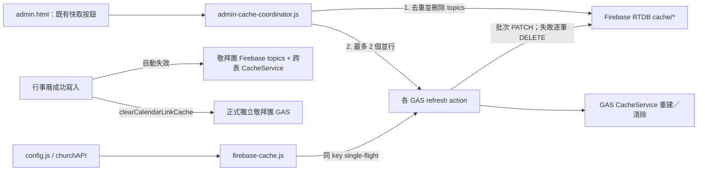
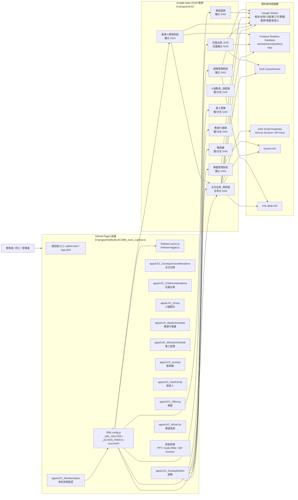
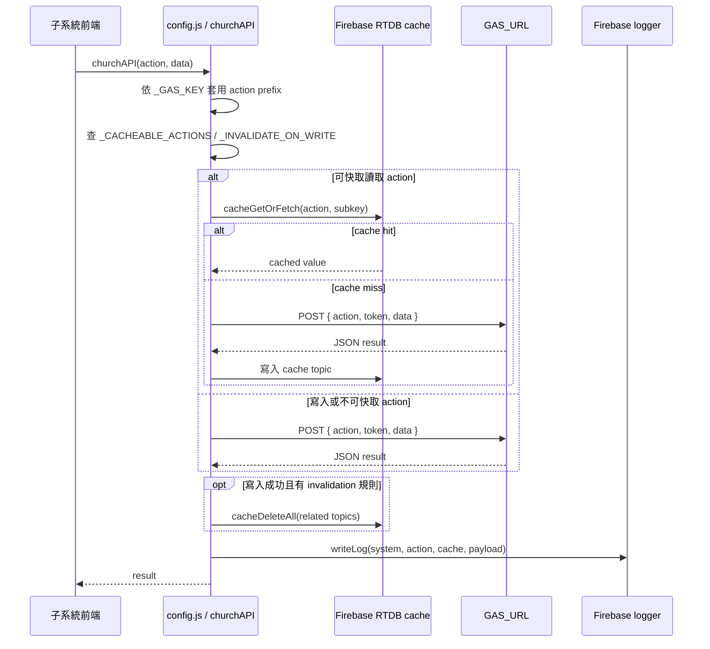
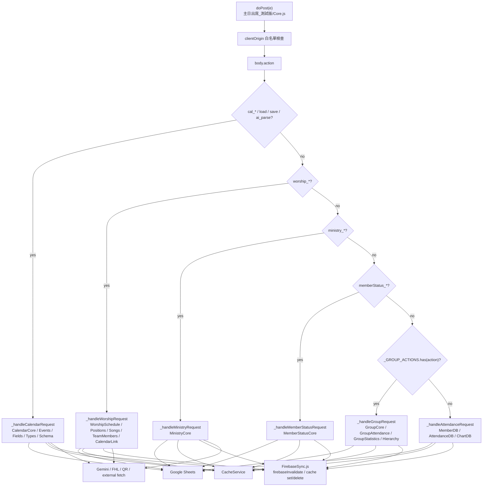
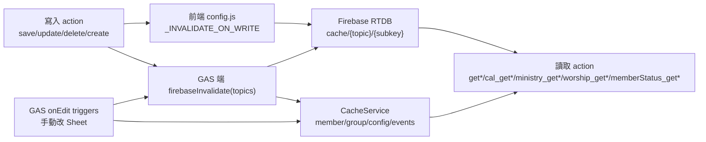
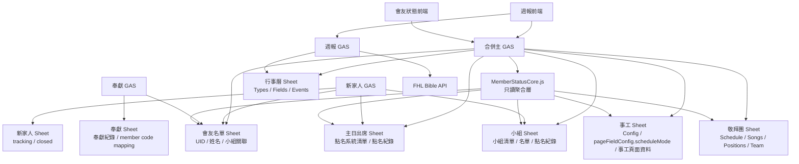
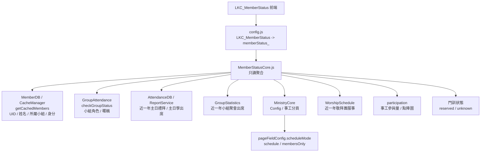

# LKC1958 整體系統關聯圖

## 管理入口快取維護流程（2026-07）



- 使用者操作契約不變：入口、按鈕、確認視窗、成功／失敗提示與 action 名稱維持原樣。
- 單一與全量維護都採「刪除舊 Firebase topic → 呼叫 GAS refresh」，避免 warm cache 被後續刪除。
- `firebase/cache-single-flight.mjs` 只合併同一瀏覽器頁面中相同 topic/subkey 的進行中請求；完成或失敗後立即釋放。
- GAS `firebaseInvalidate(topics)` 使用一次 RTDB root PATCH 清除多個 topic；非 2xx 或例外時保留逐筆刪除 fallback。
- 行事曆成功寫入會由主 GAS 直接對 Firebase `cache` 根節點批次失效敬拜團相依快取：正式/合併版讀取 topic、合併版跨表快取，以及正式獨立敬拜團 GAS 的跨表快取；Router 僅保留維運救援用途。
- 事工管理的 `pageFieldConfig` 是前端班表與主 GAS 的設定契約；`scheduleTarget=clusters` 與欄位 `useMemberList` 必須由 GAS 正規化後原樣保存，才能讓小組群清單在重載後繼續提供給班表欄位。
- `LKC_MinistrySchedule/script.js` 讀取 `pageFieldConfig` 時，以 GAS 已儲存欄位設定覆蓋同名 localStorage 欄位；只保留本機獨有暫存欄位，避免瀏覽器舊快取阻斷新的小組群 datalist。
- 新家人服事模板同時輸出角色專用 datalist 與完整 `customMembersList`；班表中任何 `useMemberList=true` 的自訂欄位，皆可取得已儲存的同工或小組群名單。
- 聚會型模板的 `members`（核心＋一般）與 `coreMembers`（核心＋陪伴）由主 GAS 依小組角色提供；前端不得以事工自訂名單覆蓋前者，分別供破冰／敬拜與話語分享等欄位使用。

> 產生方式：使用 codebase MCP 對前端 `D:\program\Github\LKC1958_June_1.github.io` 與後端 `D:\program\LKC` 建立索引後，搭配實際入口檔案核對整理。
>
> 主要依據：
> - 前端中央路由：`config.js`
> - 後端合併主 GAS：`D:\program\LKC\主日出席_測試版\Core.js`
> - GAS 端 Firebase 同步：`D:\program\LKC\主日出席_測試版\FirebaseSync.js`
> - 各獨立 GAS 入口：`新家人管理系統/Code.js`、`奉獻管理系統/程式碼.js`、`車號查詢/core.js`、`週報管理系統/程式碼.js`、`兒童出席_GAS/Core.js`

## 1. 系統部署總覽



## 2. 前端中央 API 與快取流程



## 3. 合併主 GAS 後端分流



## 4. 子系統到 action contract 的關聯

```mermaid
flowchart TB
    subgraph FE["前端子系統"]
        Sunday["主日出席<br/>api.js / attendance.js / STATS.js"]
        Group["小組點名<br/>index.js / group.js / manage.js / stats.js"]
        Calendar["教會行事曆<br/>calendar.js / types.js"]
    Ministry["事工管理<br/>script.js"]
    Worship["敬拜團<br/>script.js / worship_songs.js"]
    MemberStatus["會友狀態監控<br/>index.html / script.js"]
    Children["兒童出席<br/>api.js / attendance.js / STATS.js"]
        NewFamily["新家人<br/>script.js"]
        Offering["奉獻<br/>js/api.js"]
        Bulletin["週報<br/>js/api.js"]
        Car["車號查詢<br/>index.html"]
    end

    subgraph Prefix["config.js action 前綴"]
        NoPrefix["無前綴<br/>主日/小組/奉獻/新家人/車號"]
        MinistryPrefix["ministry_*"]
        WorshipPrefix["worship_*"]
        MemberStatusPrefix["memberStatus_*"]
        ChildrenPrefix["children_*"]
        CalendarPrefix["cal_*"]
    end

    subgraph Backend["後端入口"]
        Main["合併主 GAS<br/>主日出席_測試版/Core.js"]
        ChildrenGAS["兒童出席_GAS/Core.js"]
        NewFamilyGAS["新家人管理系統/Code.js"]
        OfferingGAS["奉獻管理系統/程式碼.js"]
        CarGAS["車號查詢/core.js"]
        BulletinGAS["週報管理系統/程式碼.js"]
    end

    Sunday --> NoPrefix --> Main
    Group --> NoPrefix --> Main
    Calendar --> CalendarPrefix --> Main
    Ministry --> MinistryPrefix --> Main
    Worship --> WorshipPrefix --> Main
    MemberStatus --> MemberStatusPrefix --> Main
    Children --> ChildrenPrefix --> ChildrenGAS
    NewFamily --> NoPrefix --> NewFamilyGAS
    Offering --> NoPrefix --> OfferingGAS
    Car --> NoPrefix --> CarGAS

    Bulletin --> BulletinGAS
    Bulletin --> Main
    Bulletin --> MinistryPrefix
    Bulletin --> CalendarPrefix
    Bulletin --> WorshipPrefix
```



### 主要 action 分組

| 分組 | 前端來源 | 後端 handler | 代表 action |
|---|---|---|---|
| 主日出席 | `apps/LKC_SundayserviceAttendance` | `_handleAttendanceRequest` | `getAllMembers`, `getSmartAttendanceList`, `saveAttendance`, `getAttendanceStats` |
| 小組點名 | `apps/LKC_Group` | `_handleGroupRequest` | `getGroups`, `verifyGroup`, `submitAttendance`, `getWeeklyReport`, `happyGroup_*` |
| 事工管理 | `apps/LKC_MinistrySchedule` | `_handleMinistryRequest` | `ministry_getGroups`, `ministry_getPageConfig`, `ministry_saveSheetData`, `ministry_savePageFieldConfig`, `ministry_saveGroupMembers`, `ministry_getGroupMembers` |
| 教會行事曆 | `apps/LKC_MasterSchedule` | `_handleCalendarRequest` | `cal_getTypes`, `cal_getFields`, `cal_getEvents`, `cal_addEvent`, `cal_queryBible` |
| 敬拜團 | `apps/LKC_worship` | `_handleWorshipRequest` | `worship_getSchedule`, `worship_getScheduleByDateRange`, `worship_getPositions`, `worship_getTeamMembers`, `worship_getSongs`, `worship_saveSchedule`, `worship_savePositions`, `worship_saveTeamMembers`, `worship_saveSongs` |
| 會友狀態監控 | `apps/LKC_MemberStatus` | `_handleMemberStatusRequest` | `memberStatus_getMembers`, `memberStatus_getProfile`, `memberStatus_getServiceIndex`, `memberStatus_refreshCaches` |
| 兒童出席 | `apps/LKC_ChildrenAttendance` | `兒童出席_GAS/Core.js` | `children_getAllMembers`, `children_getSmartAttendanceList`, `children_saveAttendance` |
| 新家人 | `apps/LKC_NewFamily` | `新家人管理系統/Code.js` | `getTrackingCases`, `getClosedCases`, `updateTrackingCase`, `closeCases` |
| 奉獻 | `apps/LKC_Offering` | `奉獻管理系統/程式碼.js` | `queryMemberOffering`, `adminAddOfferings`, `processReceiptImage`, `searchMemberCode` |
| 車號查詢 | `apps/LKC_WhosCar` | `車號查詢/core.js` | GET 車牌查詢 / keep alive |
| 週報 | `apps/LKC_SundayBulletin` | `週報管理系統/程式碼.js` + 多系統讀取 | 週報草稿/經文查詢/主日/小組/敬拜/行事曆聚合 |

### 近期更新關聯

| 系統 | 更新點 | 架構影響 |
|---|---|---|
| 事工管理 | 非 `小組聚會表模板` / `團契聚會表模板` 的事工頁面增加 `pageFieldConfig.scheduleMode`，可在 `schedule` 與 `membersOnly` 間切換 | `schedule` 沿用既有班表資料流；`membersOnly` 只維護 `ministry_saveGroupMembers` 成員名單，不讀班表。舊資料未設定時視為 `schedule`，保留既有行為 |
| 事工管理 | `ministry_savePageFieldConfig` 會保存 `scheduleMode` | 需要同步失效 `ministry_getPageConfig`、`ministry_getAggregatedReport` 與 `memberStatus_*`，避免會友狀態仍讀到舊模式 |
| 敬拜團 | 管理端補強年度/季度排班、位置設定、團員名單、歌曲庫、行事曆連結快取操作 | `LKC_worship_TEST` 透過 `config.js` 加 `worship_` 前綴後進入合併主 GAS；位置/團員/歌曲各自對應 `worship_savePositions`、`worship_saveTeamMembers`、`worship_saveSongs` 與相關 cache topic |
| 敬拜團 | 會友狀態監控讀取敬拜團近一年服事 | `MemberStatusCore.js` 直接讀 `getScheduleByDateRange` 聚合敬拜團欄位；敬拜團班表或團員異動需失效 `memberStatus_getMembers`、`memberStatus_getProfile`、`memberStatus_getServiceIndex` |

## 5. Firebase / CacheService 失效關聯



### 高影響失效主題

| 觸發來源 | 會影響的 cache topic |
|---|---|
| 會友名單異動 | `getAllMembers`, `getAllGroupMembers`, `getMemberSuggestions`, `getStats`, `ministry_getPageConfig`, `getSmartAttendanceList` |
| 小組名單/小組清單異動 | `getGroups`, `getAdminGroupsList`, `checkGroupStatus`, `ministry_getGroups`, `ministry_getGroupMembers` |
| 主日點名異動 | `getWeeklyReport`, `getAttendanceStats`, `getAttendanceTrend`, `getSmartAttendanceList`, `getCategoryChartData` |
| 小組點名異動 | `getWeeklyReport`, `getStats`, `getAllGroupsStats`, `checkGroupStatus` |
| 事工異動 | `ministry_getGroups`, `ministry_getAggregatedReport`, `ministry_getPageConfig`, `memberStatus_getMembers`, `memberStatus_getProfile`, `memberStatus_getServiceIndex` |
| 行事曆異動 | `cal_getTypes`, `cal_getFields`, `cal_getEvents`, `cal_getEvent`, `getSchedule`, `getScheduleByDateRange` |
| 敬拜團異動 | `worship_getSchedule`, `worship_getScheduleByDateRange`, `worship_getPositions`, `worship_getSongs`, `worship_getTeamMembers`, `memberStatus_getMembers`, `memberStatus_getProfile`, `memberStatus_getServiceIndex` |
| 會友狀態刷新 | `memberStatus_getMembers`, `memberStatus_getProfile`, `memberStatus_getServiceIndex`, `memberStatus_getDiscipleshipStatus` |
| 兒童出席異動 | `children_getAllMembers`, `children_getSmartAttendanceList`, `children_getAttendanceStats`, `children_getAttendanceTrend` |

## 6. 資料儲存與跨系統讀取



## 7. codebase MCP 索引狀態

| Repo | MCP project | 索引模式 | 結果 |
|---|---|---|---|
| `D:\program\Github\LKC1958_June_1.github.io` | `D-program-Github-LKC1958_June_1.github.io` | `moderate` | 已索引，約 2007 nodes / 5342 edges |
| `D:\program\LKC` | `D-program-LKC` | `moderate` | 已索引，約 155 nodes / 162 edges |

注意：後端 `D:\program\LKC` 有大量 Apps Script / 中文目錄 / `.gs` 檔，codebase MCP 對符號層解析較少，因此本圖的後端 action 分流另外用實際入口檔案核對。前端 repo 的函式與 API wrapper 解析較完整。

## 8. 會友狀態監控讀取策略

`apps/LKC_MemberStatus` 是只讀監控系統，不寫回任何來源系統。後端由 `D:\program\LKC\主日出席_測試版\MemberStatusCore.js` 聚合資料，經 `memberStatus_*` actions 暴露。



| 來源 | v1 讀取規則 |
|---|---|
| 主日會友名單 | `UID` 為主鍵，姓名只作顯示與 fallback |
| 會友名單狀態 | `不列入統計` / `不統計` 的會友不進入會友狀態監控、不參與篩選與圖表 |
| 小組/團契歸屬 | 使用會友 cache 的 `所屬小組` + `身分` |
| 主日禮拜出席 | 讀近一年 `台語點名紀錄` / `華語點名紀錄` / `聯合點名紀錄`，計算 `count / total / rate / lastDate` |
| 主日學出席 | 讀近一年名稱含 `主日學` 的點名紀錄，計算 `count / total / rate / lastDate` |
| 小組聚會出席 | 讀近一年 `*_點名紀錄`，只對會友目前分屬小組/團契計算出席摘要 |
| 事工系統：`小組聚會表模板` / `團契聚會表模板` | 讀名單 + 近一年班表，統計小組/團契服事 |
| 事工系統：非小組聚會模板 + `scheduleMode=schedule` 或舊資料未設定 | 讀名單 + 近一年班表，統計教會事工服事；`姓名` / `成員` 等名單欄位不當作服事欄位 |
| 事工系統：非小組聚會模板 + `scheduleMode=membersOnly` | 只讀名單，判斷是否屬於該教會事工；不讀班表 |
| 敬拜團 | 讀近一年 `getScheduleByDateRange` 服事紀錄；前端經 `worship_getScheduleByDateRange` 讀取，會友狀態後端在合併主 GAS 內直接呼叫同一組函式 |
| 事工參與量 | `groupMinistries + churchMinistries + worship.positions` 產生 `participation`；前端點陣圖預設顯示排序前 24 位，點擊「顯示完整 N 人」後呈現目前篩選結果的完整名單 |
| 前端請求時機 | 首次載入只呼叫 `memberStatus_getMembers`；使用者點選會友後才呼叫 `memberStatus_getProfile`，避免首屏額外等待一次 GAS 往返 |
| 門訓 | 保留 `discipleship` 欄位，第一版回 `unknown` |
| 無法配對姓名 | 放入 `unresolvedParticipants`，不硬配 UID |

## 禮拜PPT產生器（台語／聯合華語）

子系統的完整技術架構、模組責任、資料契約、失敗回退與多模板擴充原則，統一維護於 [`apps/LKC_WorshipPPT/ARCHITECTURE.md`](../apps/LKC_WorshipPPT/ARCHITECTURE.md)。本節只保留跨系統關係摘要。

```text
admin.html → apps/LKC_WorshipPPT/
禮拜PPT產生器 → localStorage 草稿 + 16:9 即時預覽
禮拜PPT產生器 → template-profiles.js → 台語或聯合－華語 sections／固定頁／資料需求／母片資產／檔名前綴
禮拜PPT產生器 → firebase/firebase-config-values.js 共用 bootstrap → 絕對 gstatic SDK URL → firebase-content-store.js／layout-cloud-store.js（避免 `about:blank` 或 `file://` 下的相對動態 import 解析失敗）
禮拜PPT產生器 → Firebase RTDB `worshipPpt/content/...`（行事曆／報告／讚美／Library 索引／聖經的唯讀內容鏡像）
禮拜PPT產生器 → config.js / churchAPI → LKC_MasterSchedule GAS `cal_getEvents`
禮拜PPT產生器 → config.js / churchAPI → LKC_MasterSchedule GAS `cal_getPptLibraryIndex`
禮拜PPT產生器 → 週報管理系統 GAS `load` → `reports_YYYY-MM-DD`（本會消息／教界消息／關懷代禱，依序產生報告頁）
禮拜PPT產生器 → 週報管理系統 GAS `load` → `praise_songs_YYYY-MM-DD`（聖歌隊讚美）
禮拜PPT產生器（file:// 或 POST 被擋）→ read-api.js JSONP → GAS 唯讀 `cal_getEvents` / `cal_getPptLibraryIndex` / `cal_getPptLibraryFile` / `cal_queryBible`
LKC_MasterSchedule GAS → Google Drive 聖詩／啟應文資料夾（唯讀檔案索引）
禮拜PPT產生器（聯合華語）→ `templates/` 三張 16:9 PNG → 全心敬拜／奉獻／獻上感恩完整圖像頁（不拆字、不呼叫 GAS）
禮拜PPT產生器 → GAS `cal_getPptLibraryFile` → 台語聖詩／啟應文索引內 PPTX Base64
禮拜PPT產生器 → pptx-library.js（瀏覽器內解析圖片、文字、座標與 PowerPoint `srcRect` 正／負裁切；樂譜／啟應文依來源與目的矩形點陣化為透明整頁 PNG）
禮拜PPT產生器 → bulletin-content.js（本會消息、教界消息、關懷代禱依有效字級、內容框寬高、行距及輸出比例動態分頁；不保存估算軟換行，超長單項才產生續頁）
禮拜PPT產生器 → source-reminders.js（帶入完成後以一次非阻擋警告視窗，列出空白的行事曆欄位、週報分類／讚美、經文查詢或找不到的 PPT 素材）
禮拜PPT產生器 → LKC_ppt_generator/bible-service.js（經文代號解析；profile 決定 `tghg` 或 `tghg`＋`unv`）
禮拜PPT產生器 → slide-production.js（全文分頁；聯合華語信經／主禱文保留左右兩個獨立文字框）
禮拜PPT產生器 → layout-groups.js（勾選頁面＋具名參數群組；報告版面異動或雲端版面載入時觸發重新分頁）
禮拜PPT產生器 → Firebase RTDB `worshipPpt/layoutConfig/shared`（需 Auth 解鎖寫入的共用版面；localStorage 保存離線備份與待同步狀態）
禮拜PPT產生器（聯合華語）→ Firebase RTDB `worshipPpt/layoutConfig/templates/joint-mandarin`（與台語 page assignments 隔離）
禮拜PPT產生器（聯合台語）→ Firebase RTDB `worshipPpt/layoutConfig/templates/joint-taiwanese`（首次無設定時讀取台語 `shared` 作為初始 clone，但信仰告白／主禱文排除台語 assignment，改用聯合華語雙欄模板參數；保存後獨立）
禮拜PPT產生器 → ppt-export.js / PptxGenJS（匯出前重新確認報告分頁，再產生完整禮拜 PPTX）
```

行事曆帶入沿用既有 `LKC_MasterSchedule` Router 與 `cal_getEvents` 快取讀取，依 active profile 嚴格選取同日期的 `講道資訊-台語`、`講道資訊-聯合-台語` 或 `講道資訊-聯合-華語`。內容讀取以 Firebase 鏡像為優先，沒有鏡像或讀取失敗時才回退 `churchAPI` POST；由 `file://` 直接開啟或 POST 遭跨來源政策拒絕時，`read-api.js` 改用 GAS 唯讀 JSONP，僅允許 `cal_getEvents`、`cal_getPptLibraryIndex`、`cal_getPptLibraryFile`、`cal_queryBible`。映射結果先成為 `sourceValue`：講題與講員可直接顯示；宣召、經文與金句由瀏覽器解析範圍後依 profile 查詢台語或華語聖經全文並分頁。台語與聯合台語模板使用聖詩／啟應文 Library；聯合台語的宣召、信仰告白、主禱文、經文與金句為台華雙語，雙欄禮文沿用聯合華語版型。聯合華語的全心敬拜、奉獻與獻上感恩直接使用專案內三張 16:9 PNG 原圖，完整保留圖片中的文字排版、背景與視覺效果，不再依賴外部簡報或 GAS。每張產生後的投影片具有穩定 `pageId`，使用者可將不同勾選批次存成具名版面群組；群組參數與頁面歸屬按 template ID 同步到 Firebase，並以不同 localStorage key 保存草稿與待同步狀態。

### 多模板擴充邊界（台語、聯合台語與聯合華語已實作）

「台語」、「聯合－台語」與「聯合－華語」共用資料回退、PPTX／OOXML 解析、Canvas 點陣化、報告動態分頁、deck/page ID、版面群組與 PptxGenJS 匯出核心；流程段落、行事曆 selector、聖經版本、固定禮文、固定素材、預設版面、來源需求與輸出檔名由 declarative template profile 提供。模板版面已分為既有 `worshipPpt/layoutConfig/shared` 與 `worshipPpt/layoutConfig/templates/{templateId}`；聯合台語僅在尚無專屬設定時以台語版面作為初始 fallback。同日內容若未來因模板而不同，仍應再評估 `worshipPpt/content/services/{date}/{templateId}/...`；目前內容鏡像 schema 尚未遷移。
