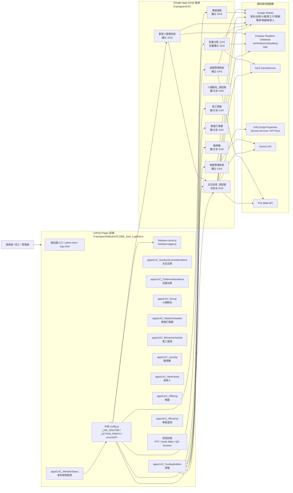
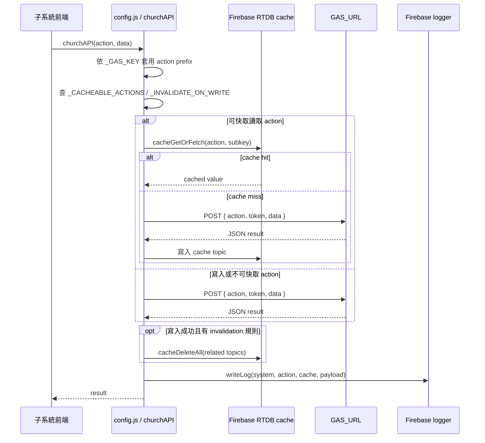
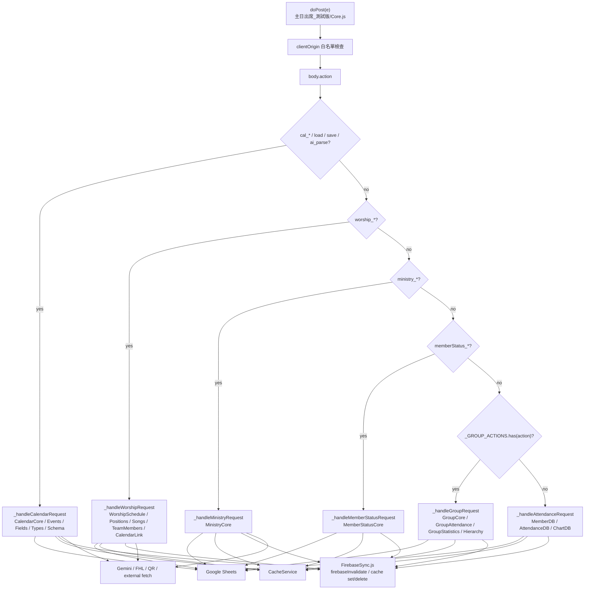
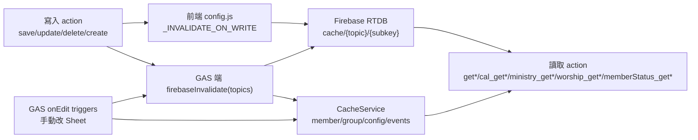
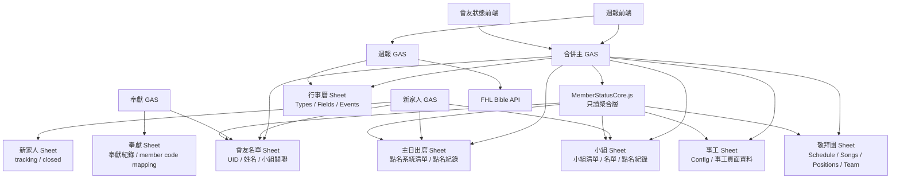
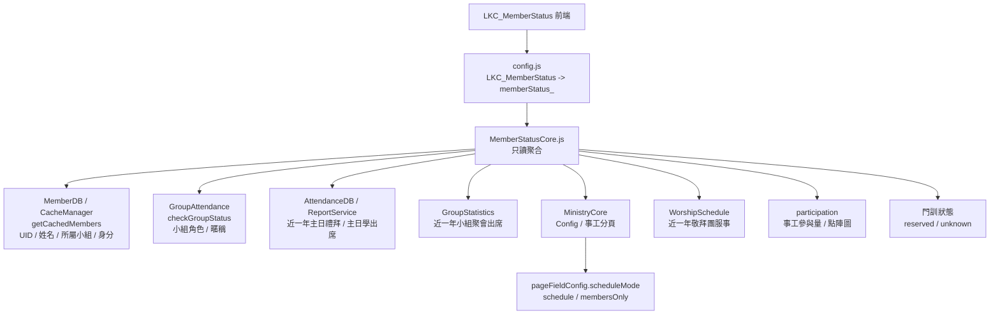

# LKC1958 整體系統關聯圖

> 產生方式：使用 codebase MCP 對前端 `D:\program\Github\LKC1958_June_1.github.io` 與後端 `D:\program\LKC` 建立索引後，搭配實際入口檔案核對整理。
>
> 主要依據：
> - 前端中央路由：`config.js`
> - 後端合併主 GAS：`D:\program\LKC\主日出席_測試版\Core.js`
> - GAS 端 Firebase 同步：`D:\program\LKC\主日出席_測試版\FirebaseSync.js`
> - 各獨立 GAS 入口：`新家人管理系統/Code.js`、`奉獻管理系統/程式碼.js`、`車號查詢/core.js`、`週報管理系統/程式碼.js`、`兒童出席_GAS/Core.js`

## 1. 系統部署總覽

## 2. 前端中央 API 與快取流程

## 3. 合併主 GAS 後端分流

## 4. 子系統到 action contract 的關聯

```mermaid
flowchart TB
    subgraph FE["前端子系統"]
        Sunday["主日出席<br/>api.js / attendance.js / STATS.js"]
        Group["小組點名<br/>index.js / group.js / manage.js / stats.js"]
        Calendar["教會行事曆<br/>calendar.js / types.js"]
    Ministry["事工管理<br/>script.js"]
    Worship["敬拜團<br/>script.js / worship_songs.js"]
    MemberStatus["會友狀態監控<br/>index.html / script.js"]
    Children["兒童出席<br/>api.js / attendance.js / STATS.js"]
        NewFamily["新家人<br/>script.js"]
        Offering["奉獻<br/>js/api.js"]
        Bulletin["週報<br/>js/api.js"]
        Car["車號查詢<br/>index.html"]
    end

    subgraph Prefix["config.js action 前綴"]
        NoPrefix["無前綴<br/>主日/小組/奉獻/新家人/車號"]
        MinistryPrefix["ministry_*"]
        WorshipPrefix["worship_*"]
        MemberStatusPrefix["memberStatus_*"]
        ChildrenPrefix["children_*"]
        CalendarPrefix["cal_*"]
    end

    subgraph Backend["後端入口"]
        Main["合併主 GAS<br/>主日出席_測試版/Core.js"]
        ChildrenGAS["兒童出席_GAS/Core.js"]
        NewFamilyGAS["新家人管理系統/Code.js"]
        OfferingGAS["奉獻管理系統/程式碼.js"]
        CarGAS["車號查詢/core.js"]
        BulletinGAS["週報管理系統/程式碼.js"]
    end

    Sunday --> NoPrefix --> Main
    Group --> NoPrefix --> Main
    Calendar --> CalendarPrefix --> Main
    Ministry --> MinistryPrefix --> Main
    Worship --> WorshipPrefix --> Main
    MemberStatus --> MemberStatusPrefix --> Main
    Children --> ChildrenPrefix --> ChildrenGAS
    NewFamily --> NoPrefix --> NewFamilyGAS
    Offering --> NoPrefix --> OfferingGAS
    Car --> NoPrefix --> CarGAS

    Bulletin --> BulletinGAS
    Bulletin --> Main
    Bulletin --> MinistryPrefix
    Bulletin --> CalendarPrefix
    Bulletin --> WorshipPrefix
```

### 主要 action 分組

| 分組 | 前端來源 | 後端 handler | 代表 action |
|---|---|---|---|
| 主日出席 | `apps/LKC_SundayserviceAttendance` | `_handleAttendanceRequest` | `getAllMembers`, `getSmartAttendanceList`, `saveAttendance`, `getAttendanceStats` |
| 小組點名 | `apps/LKC_Group` | `_handleGroupRequest` | `getGroups`, `verifyGroup`, `submitAttendance`, `getWeeklyReport`, `happyGroup_*` |
| 事工管理 | `apps/LKC_MinistrySchedule` | `_handleMinistryRequest` | `ministry_getGroups`, `ministry_getPageConfig`, `ministry_saveSheetData`, `ministry_savePageFieldConfig`, `ministry_saveGroupMembers`, `ministry_getGroupMembers` |
| 教會行事曆 | `apps/LKC_MasterSchedule` | `_handleCalendarRequest` | `cal_getTypes`, `cal_getFields`, `cal_getEvents`, `cal_addEvent`, `cal_queryBible` |
| 敬拜團 | `apps/LKC_worship` | `_handleWorshipRequest` | `worship_getSchedule`, `worship_getPositions`, `worship_getSongs`, `worship_saveSchedule` |
| 會友狀態監控 | `apps/LKC_MemberStatus` | `_handleMemberStatusRequest` | `memberStatus_getMembers`, `memberStatus_getProfile`, `memberStatus_getServiceIndex`, `memberStatus_refreshCaches` |
| 兒童出席 | `apps/LKC_ChildrenAttendance` | `兒童出席_GAS/Core.js` | `children_getAllMembers`, `children_getSmartAttendanceList`, `children_saveAttendance` |
| 新家人 | `apps/LKC_NewFamily` | `新家人管理系統/Code.js` | `getTrackingCases`, `getClosedCases`, `updateTrackingCase`, `closeCases` |
| 奉獻 | `apps/LKC_Offering` | `奉獻管理系統/程式碼.js` | `queryMemberOffering`, `adminAddOfferings`, `processReceiptImage`, `searchMemberCode` |
| 車號查詢 | `apps/LKC_WhosCar` | `車號查詢/core.js` | GET 車牌查詢 / keep alive |
| 週報 | `apps/LKC_SundayBulletin` | `週報管理系統/程式碼.js` + 多系統讀取 | 週報草稿/經文查詢/主日/小組/敬拜/行事曆聚合 |

## 5. Firebase / CacheService 失效關聯

### 高影響失效主題

| 觸發來源 | 會影響的 cache topic |
|---|---|
| 會友名單異動 | `getAllMembers`, `getAllGroupMembers`, `getMemberSuggestions`, `getStats`, `ministry_getPageConfig`, `getSmartAttendanceList` |
| 小組名單/小組清單異動 | `getGroups`, `getAdminGroupsList`, `checkGroupStatus`, `ministry_getGroups`, `ministry_getGroupMembers` |
| 主日點名異動 | `getWeeklyReport`, `getAttendanceStats`, `getAttendanceTrend`, `getSmartAttendanceList`, `getCategoryChartData` |
| 小組點名異動 | `getWeeklyReport`, `getStats`, `getAllGroupsStats`, `checkGroupStatus` |
| 事工異動 | `ministry_getGroups`, `ministry_getAggregatedReport`, `ministry_getPageConfig`, `memberStatus_getMembers`, `memberStatus_getProfile`, `memberStatus_getServiceIndex` |
| 行事曆異動 | `cal_getTypes`, `cal_getFields`, `cal_getEvents`, `cal_getEvent`, `getSchedule`, `getScheduleByDateRange` |
| 敬拜團異動 | `worship_getSchedule`, `worship_getScheduleByDateRange`, `worship_getPositions`, `worship_getSongs`, `worship_getTeamMembers` |
| 會友狀態刷新 | `memberStatus_getMembers`, `memberStatus_getProfile`, `memberStatus_getServiceIndex`, `memberStatus_getDiscipleshipStatus` |
| 兒童出席異動 | `children_getAllMembers`, `children_getSmartAttendanceList`, `children_getAttendanceStats`, `children_getAttendanceTrend` |

## 6. 資料儲存與跨系統讀取

## 7. codebase MCP 索引狀態

| Repo | MCP project | 索引模式 | 結果 |
|---|---|---|---|
| `D:\program\Github\LKC1958_June_1.github.io` | `D-program-Github-LKC1958_June_1.github.io` | `moderate` | 已索引，約 2007 nodes / 5342 edges |
| `D:\program\LKC` | `D-program-LKC` | `moderate` | 已索引，約 155 nodes / 162 edges |

注意：後端 `D:\program\LKC` 有大量 Apps Script / 中文目錄 / `.gs` 檔，codebase MCP 對符號層解析較少，因此本圖的後端 action 分流另外用實際入口檔案核對。前端 repo 的函式與 API wrapper 解析較完整。

## 8. 會友狀態監控讀取策略

`apps/LKC_MemberStatus` 是只讀監控系統，不寫回任何來源系統。後端由 `D:\program\LKC\主日出席_測試版\MemberStatusCore.js` 聚合資料，經 `memberStatus_*` actions 暴露。

| 來源 | v1 讀取規則 |
|---|---|
| 主日會友名單 | `UID` 為主鍵，姓名只作顯示與 fallback |
| 會友名單狀態 | `不列入統計` / `不統計` 的會友不進入會友狀態監控、不參與篩選與圖表 |
| 小組/團契歸屬 | 使用會友 cache 的 `所屬小組` + `身分` |
| 主日禮拜出席 | 讀近一年 `台語點名紀錄` / `華語點名紀錄` / `聯合點名紀錄`，計算 `count / total / rate / lastDate` |
| 主日學出席 | 讀近一年名稱含 `主日學` 的點名紀錄，計算 `count / total / rate / lastDate` |
| 小組聚會出席 | 讀近一年 `*_點名紀錄`，只對會友目前分屬小組/團契計算出席摘要 |
| 事工系統：`小組聚會表模板` / `團契聚會表模板` | 讀名單 + 近一年班表，統計小組/團契服事 |
| 事工系統：非小組聚會模板 + `scheduleMode=schedule` 或舊資料未設定 | 讀名單 + 近一年班表，統計教會事工服事；`姓名` / `成員` 等名單欄位不當作服事欄位 |
| 事工系統：非小組聚會模板 + `scheduleMode=membersOnly` | 只讀名單，判斷是否屬於該教會事工；不讀班表 |
| 敬拜團 | 讀近一年 `getScheduleByDateRange` 服事紀錄 |
| 事工參與量 | `groupMinistries + churchMinistries + worship.positions` 產生 `participation`，前端以點陣圖呈現高低 |
| 門訓 | 保留 `discipleship` 欄位，第一版回 `unknown` |
| 無法配對姓名 | 放入 `unresolvedParticipants`，不硬配 UID |
