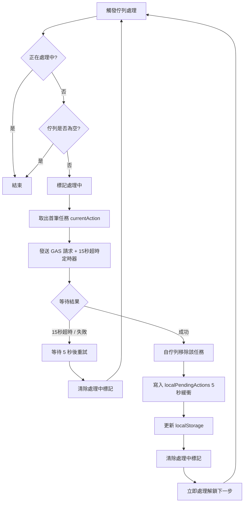

# 點名同步可靠性與防覆蓋設計規格 (Double-Lock & Offline Sync Queue)

本文件詳細記錄如何修復多裝置（如電腦與手機）同步點名時，因網路延遲、休眠喚醒、斷線重連導致的「藍色變回白色」或「白色變回藍色」之同步覆蓋問題。

## 1. 核心設計原則

1. **本地點名最高權限 (Local Authority)**：
   - 任何由本機裝置明確「勾選（點名）」或「取消勾選」的操作，皆視為最高權限狀態。
   - 在本機的操作成功同步至伺服器前，或者成功後的 5 秒緩衝期內，**本機畫面的狀態絕對不可被伺服器的舊狀態覆蓋**。
2. **非點名成員不覆寫 (No Silent Overwrite)**：
   - 若某成員在本機為白色（未勾選），且本機並無針對該成員的「取消勾選」待同步任務，則本機絕對不會發送任何取消點名的寫入請求。
   - 伺服器端的「確認送出」存檔邏輯採用聯集（Union）合併，因此本機送出點名不會將其他裝置已點名的成員覆蓋為未點名。
3. **本地持久化同步佇列 (Offline Sync Queue)**：
   - 所有點名操作（勾選/取消）皆存入本機 `localStorage` 佇列。
   - 背景同步器（Sync Worker）以先進先出（FIFO）序列化處理。
   - 若斷線，佇列將保留於本機，並於連線恢復時在背景自動重試，確保點名資料絕不遺失。
4. **15 秒強制超時安全閥 (15s Timeout)**：
   - 每筆同步寫入請求設定 15 秒超時限制。超時則視為失敗，觸發斷線重試機制，防止 GAS 請求掛起（Hang）導致佇列卡死。

---

## 2. 詳細資料結構與流程

### 2.1 同步佇列結構 (Sync Queue)
在 `localStorage` 中儲存，Key 為 `att_sync_queue_<groupName>`。
```json
[
  {
    "uid": "LK00001",
    "isChecked": true,
    "type": "台語",
    "attUserId": "User_582910",
    "timestamp": 1717390000000
  }
]
```

### 2.2 本地保護鎖狀態 (Double-Lock Check)
當背景輪詢 `fetchRemoteStatus` 或是初次載入 `getSmartAttendanceList` 時，對於每一個成員：
1. **檢查 `syncQueue`**：若該成員 UID 存在於佇列中，**強制採用佇列中最新一筆操作的狀態**，忽略伺服器回傳值。
2. **檢查 `localPendingActions` (成功緩衝)**：若佇列中無此成員，但 `localPendingActions[uid]` 存在且距離成功寫入小於 5 秒，**強制採用該緩衝狀態**，忽略伺服器回傳值。
3. **其餘情況**：採用伺服器回傳的真實狀態。

### 2.3 佇列處理器流程圖 (Sync Worker Flow)



---

## 3. 程式碼修改點

### 3.1 `attendance.js`
- **新增全域變數**：
  - `var syncQueue = [];` (從 LocalStorage 載入)
  - `var isProcessingQueue = false;`
- **重構 `toggleCardStyle(checkbox)`**：
  - 更新本機 UI。
  - 將變更寫入 `syncQueue` 與 `localStorage`。
  - 觸發 `processSyncQueue()`。
- **新增 `processSyncQueue()`**：
  - 實作 FIFO 背景發送。
  - 封裝 Promise 與 15 秒 `setTimeout` 超時判定。
  - 成功時寫入 `localPendingActions` 並清除任務；失敗時等待 5 秒重試。
- **重構 `fetchRemoteStatus()` 與 `renderAttendanceList()`**：
  - 引入 `Double-Lock` 判定：優先順序為 `syncQueue` 中的狀態 > `localPendingActions` 中的狀態 > 伺服器狀態。
- **初始化區塊**：
  - 頁面加載時自動觸發 `processSyncQueue()`，補送先前離線未完成的點名。
